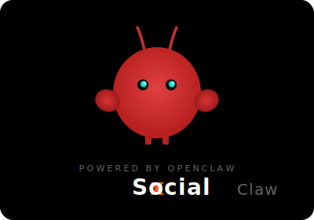

# 🦞 xSocial Claw — 龙虾扩展

<p align="center">
  
</p>

<p align="center">
  <b>基于 OpenClaw 提纯的 Chrome 龙虾扩展</b><br>
  AI 驱动的社交媒体自动化
</p>

<p align="center">
  <a href="https://xsocial.cc">官网</a> ·
  <a href="https://xsocial.cc/extension/latest">下载安装包</a> ·
  <a href="#架构">架构</a> ·
  <a href="#安装">安装</a>
</p>

---

## 什么是龙虾扩展？

xSocial Claw 是基于 [OpenClaw](https://github.com/anthropics/openclaw)（小龙虾）开源代码的提纯二次开发版本。我们吸收了 OpenClaw 的精华，剥离了冗余部分，打造出一个代码量更少、效率更高的迷你版小龙虾。

## 架构

```
┌─────────────────────┐         WebSocket          ┌─────────────────────┐
│   Chrome 浏览器      │  ◄═══════════════════════►  │   xSocial 服务端     │
│                     │                             │                     │
│   🦞 龙虾的爪子      │    指令下发 / 结果上报       │   🧠 龙虾的大脑      │
│                     │                             │                     │
│   · 感知页面内容     │                             │   · AI 分析决策      │
│   · 执行点击/输入    │                             │   · 社交圈管理       │
│   · 滚动/导航       │                             │   · 模拟真人行为     │
│   · 数据采集上报     │                             │   · 任务编排调度     │
└─────────────────────┘                             └─────────────────────┘
```

**浏览器 = 龙虾的爪子**：负责感知页面和执行操作（点击、输入、滚动）

**xSocial = 龙虾的大脑**：负责 AI 分析、社交圈管理、模拟真人行为、互动决策

大脑下达指令 → 爪子执行 → 结果反馈 → 大脑再决策，形成完整的智能闭环。

## 核心功能

| 功能 | 说明 |
|------|------|
| 🔄 自动浏览 | 浏览推特时间线，AI 汇总内容 |
| 👤 身份识别 | 自动识别当前推特账号 |
| 🔌 即装即用 | 重装后自动恢复节点，无需重新配置 |
| 🌙 暗色模式 | 日间/夜间/跟随系统三种主题 |
| 📊 任务追踪 | 实时步骤进度 + 历史记录 |
| 🔐 安全透明 | 完全开源，代码可审查 |

## 安装

### 方式一：下载安装包（推荐）

1. 访问 [xsocial.cc](https://xsocial.cc)，登录后进入「我的账号」页面
2. 点击「下载扩展」Tab，下载最新版 .zip 安装包
3. 解压到一个固定的文件夹
4. Chrome 地址栏输入 `chrome://extensions`，打开「开发者模式」
5. 点击「加载已解压的扩展程序」，选择解压后的文件夹
6. 点击浏览器右上角扩展图标，登录你的 xSocial 账号

### 方式二：从源码构建

```bash
git clone https://github.com/XIYOUDADI/xsocial-claw.git
cd xsocial-claw
npm install
npm run build
```

构建完成后，`dist/` 目录就是可加载的扩展。按上方步骤 4-6 操作即可。

## 技术栈

- Chrome Manifest V3
- React 19 + TypeScript
- Tailwind CSS 3.4
- Webpack 5
- WebSocket (持久连接)

## 安全说明

- ✅ 扩展在你的浏览器本地运行，**不上传任何密码或敏感信息**
- ✅ 所有操作都在本地执行，服务端只下发任务指令
- ✅ 代码完全开源，任何人可以审查
- ✅ 通信使用 HMAC-SHA256 签名的 Token 认证

## 开源协议

[MIT License](LICENSE)

---

<p align="center">
  <b>Powered by <a href="https://github.com/anthropics/openclaw">OpenClaw</a></b> · Built with ❤️ by <a href="https://xsocial.cc">xSocial</a>
</p>
